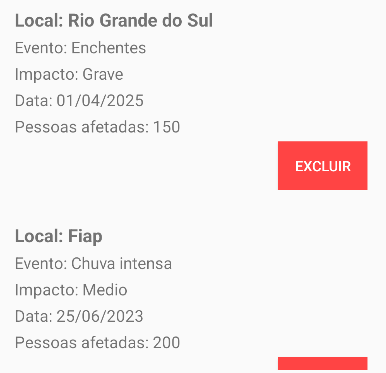

# GS 1 - Kotlin

## Vitoria Cerqueira Santos Rm: 552500
## Leonardo de Matos Queiroz Rm:552500

### 1️⃣ Tela principal com 5 EditTexts ou campos equivalentes:
### • Nome do local
### • Tipo do evento extremo (chuva intensa, seca, onda de calor, etc.)
### • Grau de impacto (leve, moderado, severo)
### • Data do evento
### • Número estimado de pessoas afetadas
### • Um Button escrito “Incluir” que adiciona o evento no RecyclerView.

---
### 2️⃣ RecyclerView:
### Cada item deve exibir todos os dados inseridos (os cinco acima), utilizando um layout customizado (não pode ser padrão simples do Android).

---
### 3️⃣ Botão excluir individual:
### Cada item no RecyclerView deve ter um botão Excluir que remova apenas aquele item da lista.

---
### 5️⃣ Título criativo no topo:
### Exemplo: “Registro de Eventos Extremos” ou outro nome criativo escolhido pelo grupo.

---
### 7️⃣ Tela adicional com identificação:
### Tela mostrando o nome e RM de todos os participantes (mínimo 1, máximo 2 alunos).

---
### 8️⃣ Bônus:
### Qualquer funcionalidade extra que o grupo acrescentar ao projeto (ex.: filtro por tipo de evento, ordenação por data, salvar e recuperar de banco local etc.)

---
[GitHub](https://github.com/Viihcerq/GSKotlin)

